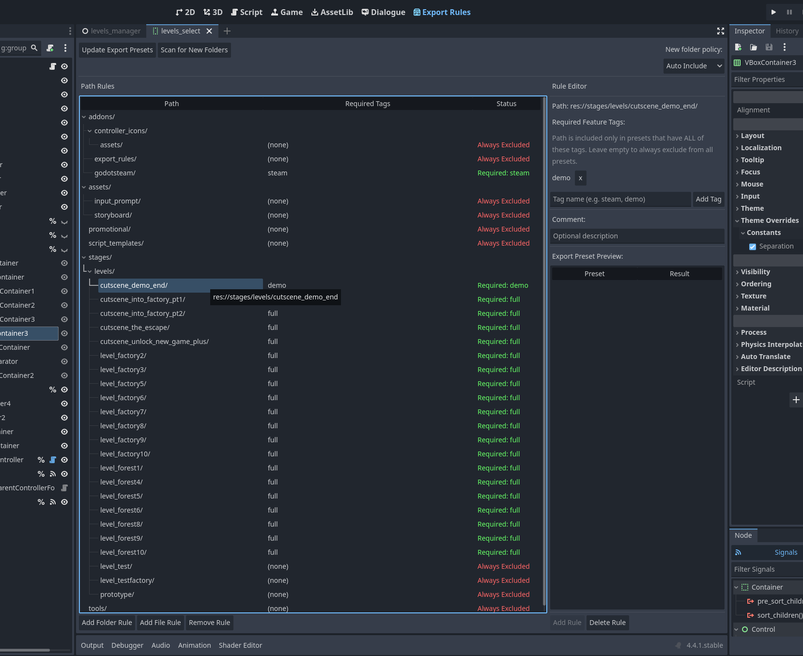
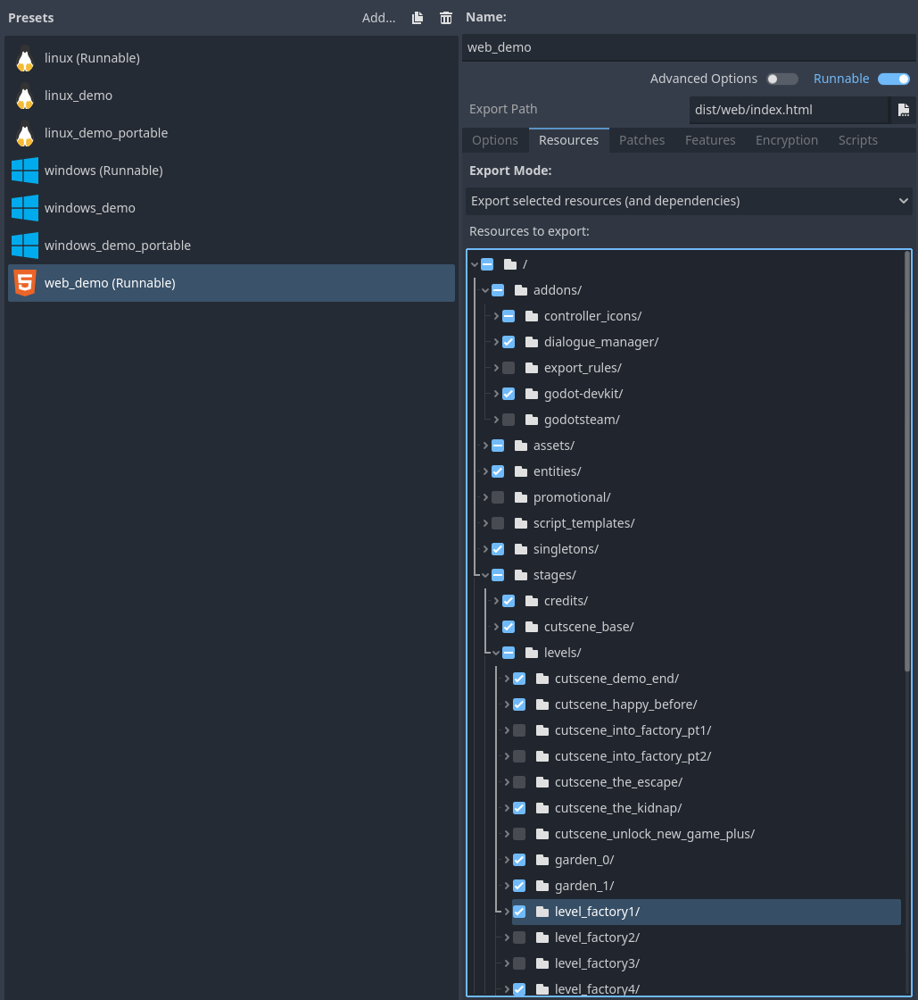
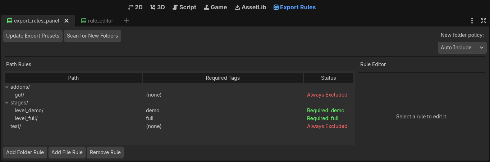

# Export Rules — Godot Addon

Tired of manually tweaking `export_presets.cfg` every time you need a demo build, a full version, or a platform-specific release? **Export Rules** lets you define once which files/folder belong to which build — and keeps your presets in sync automatically.

## The Problem

Managing multiple export variants in Godot means editing `export_presets.cfg` by hand. One preset for the demo, another for the full game, maybe one for Steam and one for itch.io — each with a different set of files. It's tedious, error-prone, and easy to forget a file.

## The Solution

Export Rules gives you a visual editor where you tag each folder or file with the presets it belongs to. Hit **Update Export Presets** and the plugin computes the right file list for every preset automatically.

|||
|-|-|

## How It Works

Every rule maps a path to a set of **required tags**:

- **No tags** → always excluded from all exports (perfect for test folders, dev tools, etc.)
- **Tags set** → included only in presets that declare all those tags

Tags come from each preset's **Custom Features** field (comma-separated). The plugin reads those, applies your rules, and writes the correct `export_files` list to each preset.

### Example

You have two export presets:
- `Demo` with `custom_features = "demo"`
- `Full` with `custom_features = "full"`

Your rules:

| Path | Required Tags | Effect |
|------|--------------|--------|
| `res://test/` | *(none)* | Excluded from every preset |
| `res://stages/level_demo/` | `demo` | Only in Demo preset |
| `res://stages/level_full/` | `full` | Only in Full preset |
| `res://stages/level_shared/` | `demo, full` | In both presets |

Everything else is included by default.



## Installation

1. Copy the `addons/export_rules/` folder into your project's `addons/` directory.
2. In Godot: **Project → Project Settings → Plugins** → enable **Export Rules**.
3. An **Export Rules** tab appears in the main editor screen.

## Usage

1. Open the **Export Rules** tab.
2. Click **Add Folder** or **Add File** to create a rule.
3. Assign required tags to the rule (e.g. `demo`, `full`, `steam`).
4. Optionally add a comment to describe what the rule does.
5. The preview on the right shows which presets will include or exclude the path.
6. Click **Update Export Presets** to apply everything to `export_presets.cfg`.

That's it. Your presets are now managed by rules instead of by hand.

## New Folder Policy

When the plugin detects a new folder in your project, it can handle it automatically. Configure this in the panel settings:

| Policy | Behavior |
|--------|----------|
| **Auto Include** | New folders are added to known paths and included in all presets |
| **Auto Exclude** | New folders are added as a rule with no tags (excluded everywhere) |
| **Ask** | The plugin prompts you to decide for each new folder |

## Configuration

Rules are stored in `export_rules.json` at your project root — commit it alongside your project.

```json
{
  "new_folder_policy": 0,
  "rules": [
    {
      "path": "res://test",
      "required_tags": [],
      "comment": "Never export tests"
    },
    {
      "path": "res://stages/level_demo",
      "required_tags": ["demo"],
      "comment": "Demo build only"
    },
    {
      "path": "res://stages/level_full",
      "required_tags": ["full"],
      "comment": "Full version only"
    }
  ]
}
```

## Requirements

- Godot 4.x
- No external dependencies — pure GDScript
